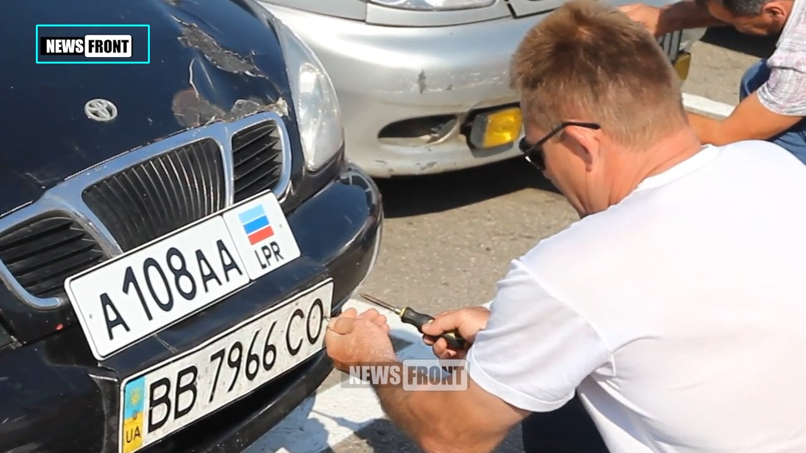
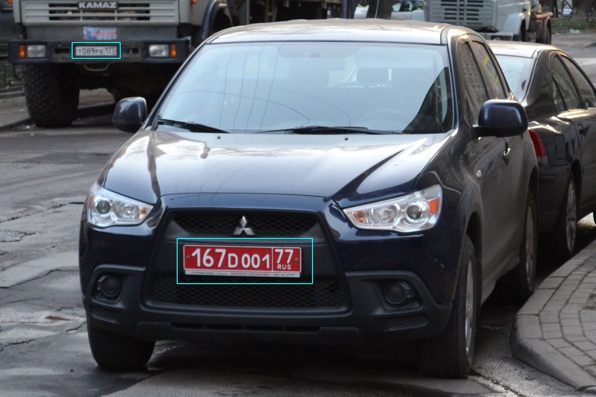
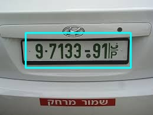
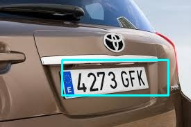
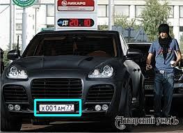
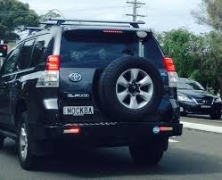
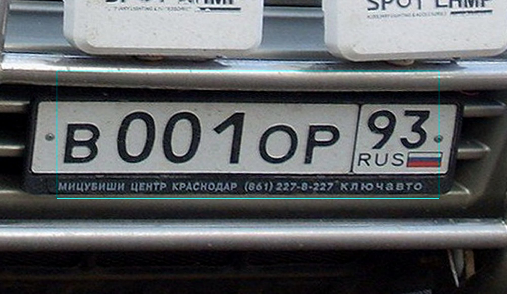
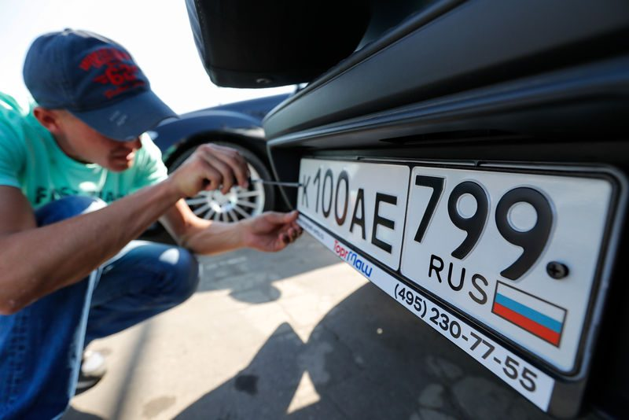
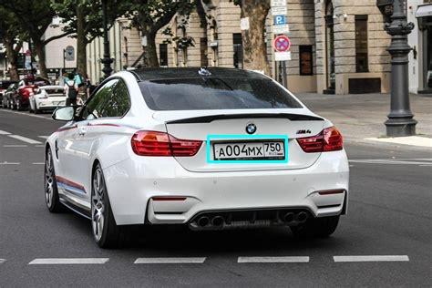

#A project of russian license plate detection with python, opencv and Adaboost algorithm
This project is an implementation of licence plate detection with opencv and Adaboost

###Usage:
    
first of all install python:

    python3.6

install requirements:
    
    pip install -r requirements.txt
    
and then run program, read --help for flags:
    
    python3 main.py 

additional stuff for downloading images, read --help for flags:

    python3 download_img.py 
    
for resize img if needed, read --help for flags:
    
    python3 resizer.py

###Requirements:

    python3-tkinter
    
###Results:
Here is presentation of **current** result:

